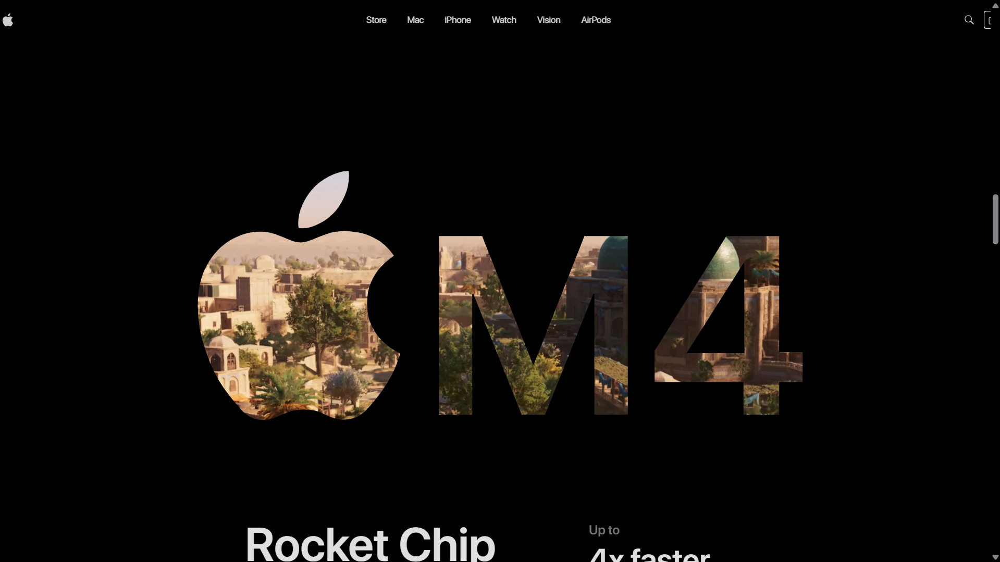
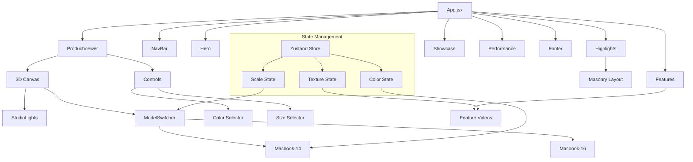
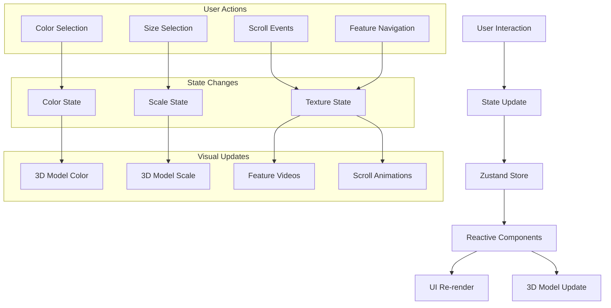

# MacBook Pro 3D Showcase Website


An immersive 3D showcase website for the MacBook Pro featuring interactive 3D models, scroll-driven animations, and responsive design.

## 🖼️ Preview

<div style="display: flex; gap: 10px;">
  
  
</div>

## 🌟 Features

| Feature | Description |
|--------|-------------|
| **3D Product Visualization** | Interactive 3D models of MacBook Pro (14" & 16") with realistic lighting |
| **Real-time Customization** | Change color (Space Gray/Dark) and size (14"/16") in real-time |
| **Scroll-driven Animations** | GSAP-powered animations triggered by scrolling |
| **Responsive Design** | Optimized for all device sizes |
| **Performance Showcase** | Dynamic image positioning and animations |
| **Feature Highlights** | Interactive feature demonstrations with video overlays |

## 🏗️ Architecture Diagram



## 🚀 Tech Stack

| Technology | Purpose |
|------------|---------|
| **React** | Component-based UI development |
| **Three.js** | 3D rendering and model handling |
| **GSAP** | Scroll-triggered animations and timeline control |
| **Tailwind CSS** | Utility-first styling |
| **Zustand** | Global state management |
| **Vite** | Build tool and dev server |

## 📁 Project Structure

```
src/
├── components/
│   ├── models/           # 3D model components
│   │   ├── Macbook-14.jsx
│   │   ├── Macbook-16.jsx
│   │   └── Macbook.jsx
│   ├── three/            # Three.js utilities
│   │   ├── ModelSwitcher.jsx
│   │   └── StudioLights.jsx
│   ├── Features.jsx      # Feature showcase
│   ├── Footer.jsx        # Page footer
│   ├── Hero.jsx          # Hero section
│   ├── Highlights.jsx    # Highlights section
│   ├── NavBar.jsx        # Navigation bar
│   ├── Performance.jsx   # Performance showcase
│   ├── ProductViewer.jsx # 3D product viewer
│   └── Showcase.jsx      # Product showcase
├── constants/            # Shared constants
│   └── index.js
├── store/                # Zustand global state
│   └── index.js
├── App.jsx               # Main application component
├── index.css             # Global styles
└── main.jsx              # Entry point
```

## 🎯 Component Flow



## 🧰 Prerequisites

- **Git** for cloning the repository
- **Node.js** (v16 or higher) and **npm** for dependency management

## ⚙️ Installation & Setup

1. **Clone the repository:**
   ```bash
   git clone <repository-url>
   ```

2. **Navigate to the project directory:**
   ```bash
   cd macbook-pro-showcase
   ```

3. **Install dependencies:**
   ```bash
   npm install
   ```

4. **Start the development server:**
   ```bash
   npm run dev
   ```

5. **Build for production:**
   ```bash
   npm run build
   ```

## 🎮 Usage

| Action | Description |
|--------|-------------|
| **Color Selection** | Click on the color circles in the product viewer to change the MacBook color |
| **Size Selection** | Toggle between 14" and 16" MacBook models |
| **Scroll Navigation** | Scroll through the page to trigger animations and feature showcases |
| **Feature Exploration** | Hover over feature icons to see detailed descriptions |

## 🛠️ Development Scripts

| Script | Description |
|--------|-------------|
| `npm run dev` | Starts the development server at http://localhost:5173 |
| `npm run build` | Creates a production build in the `dist/` directory |
| `npm run lint` | Runs ESLint to check for code issues |
| `npm run preview` | Previews the production build locally |

## 📦 Key Dependencies

| Dependency | Version | Purpose |
|------------|---------|---------|
| `react` | ^19.1.1 | Core UI library |
| `three` | ^0.180.0 | 3D rendering engine |
| `gsap` | ^3.13.0 | Animation library |
| `@react-three/fiber` | ^9.3.0 | React renderer for Three.js |
| `@react-three/drei` | ^10.7.6 | Useful helpers for react-three-fiber |
| `tailwindcss` | ^4.1.13 | CSS framework |
| `zustand` | ^5.0.8 | State management |

## 🎨 Design Highlights

### Color Palette
| Color | Hex | Usage |
|-------|-----|-------|
| **Primary** | `#0071e3` | Action buttons, links |
| **Dark Background** | `#000000` | Main background |
| **Text** | `#86868b` | Secondary text |
| **Space Gray** | `#2e2c2e` | MacBook color option |
| **Silver** | `#adb5bd` | MacBook color option |

### Typography
| Font | Weight | Usage |
|------|--------|-------|
| **Regular** | 400 | Body text |
| **Medium** | 500 | Subheadings |
| **SemiBold** | 600 | Headings, buttons |
| **Bold** | 700 | Hero titles |

## 📱 Responsive Design

The website is fully responsive and adapts to different screen sizes:

| Breakpoint | Devices | Adjustments |
|------------|---------|-------------|
| `< 640px` | Mobile | Simplified layouts, reduced spacing |
| `640px - 1024px` | Tablet | Balanced layouts, optimized controls |
| `> 1024px` | Desktop | Full feature set, enhanced visuals |

## 🤝 Contributing

1. Fork the repository
2. Create a feature branch (`git checkout -b feature/AmazingFeature`)
3. Commit your changes (`git commit -m 'Add some AmazingFeature'`)
4. Push to the branch (`git push origin feature/AmazingFeature`)
5. Open a Pull Request

## 👤 Author

**Mausam Kar**

[](https://linkedin.com/in/mausam-kar)
[](https://github.com/mausam-kar)

## 📄 License

This project is proprietary and confidential. All rights reserved.

---

<p align="center">
  Made with ❤️ using React, Three.js, and GSAP
</p>